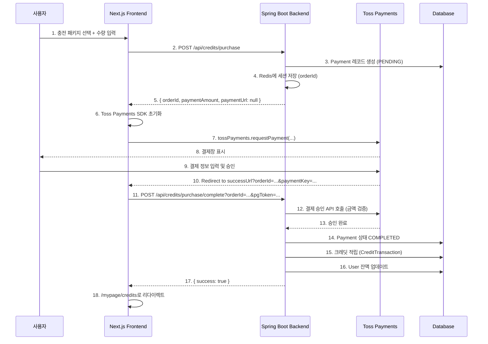

# 사용자 크레딧 API (User Credit API)

## 📌 개요

크레딧 시스템은 사용자가 크레딧을 충전하고, 사용하고, 환불할 수 있는 기능을 제공합니다.

### 핵심 개념

- **1 크레딧 = 1원 (KRW)**
- **보너스 정책**: 3만원 이상 충전 시 보너스 크레딧 제공
- **환불 수수료**: 10% (100원 단위 올림)
- **최소 환불 금액**: 1,000원

### 인증

모든 API는 JWT Bearer Token 인증이 필요합니다.

```typescript
// Next.js API Route 예시
headers: {
  'Authorization': `Bearer ${accessToken}`,
  'Content-Type': 'application/json',
}
```

---

## 📚 API 엔드포인트 목록

| Method | Endpoint | 설명 |
|--------|----------|------|
| GET | `/api/credits/balance` | 크레딧 잔액 조회 |
| GET | `/api/credits/packages` | 충전 패키지 목록 조회 |
| GET | `/api/credits/transactions` | 크레딧 거래 내역 조회 |
| POST | `/api/credits/purchase` | 크레딧 충전 요청 |
| POST | `/api/credits/purchase/complete` | 크레딧 충전 완료 콜백 |
| POST | `/api/credits/refund` | 크레딧 환불 요청 |

---

## 1️⃣ 크레딧 잔액 조회

### Endpoint
```
GET /api/credits/balance
```

### Response
```json
{
  "success": true,
  "data": {
    "balance": 50000,
    "currency": "KRW"
  }
}
```

### Next.js 예시

#### API Route (`app/api/credits/balance/route.ts`)
```typescript
import { NextRequest, NextResponse } from 'next/server';

export async function GET(request: NextRequest) {
  const token = request.cookies.get('accessToken')?.value;

  const response = await fetch(`${process.env.NEXT_PUBLIC_API_URL}/api/credits/balance`, {
    headers: {
      'Authorization': `Bearer ${token}`,
    },
    cache: 'no-store', // 항상 최신 잔액 조회
  });

  const data = await response.json();
  return NextResponse.json(data);
}
```

#### Client Component (`components/CreditBalance.tsx`)
```typescript
'use client';

import { useEffect, useState } from 'react';

interface BalanceData {
  balance: number;
  currency: string;
}

export default function CreditBalance() {
  const [balance, setBalance] = useState<BalanceData | null>(null);
  const [loading, setLoading] = useState(true);

  useEffect(() => {
    fetchBalance();
  }, []);

  const fetchBalance = async () => {
    try {
      const response = await fetch('/api/credits/balance');
      const result = await response.json();

      if (result.success) {
        setBalance(result.data);
      }
    } catch (error) {
      console.error('잔액 조회 실패:', error);
    } finally {
      setLoading(false);
    }
  };

  if (loading) return <div>로딩 중...</div>;

  return (
    <div className="credit-balance">
      <h3>보유 크레딧</h3>
      <p className="balance">
        {balance?.balance.toLocaleString()} {balance?.currency}
      </p>
    </div>
  );
}
```

---

## 2️⃣ 충전 패키지 목록 조회

### Endpoint
```
GET /api/credits/packages
```

### Response
```json
{
  "success": true,
  "data": [
    {
      "uuid": "550e8400-e29b-41d4-a716-446655440000",
      "code": "KRW_10000",
      "displayName": "1만원권",
      "unitAmount": 10000,
      "bonusRate": 0,
      "maxBonus": null,
      "bonusEligible": false,
      "description": "기본 충전 패키지",
      "isActive": true
    },
    {
      "uuid": "550e8400-e29b-41d4-a716-446655440001",
      "code": "KRW_30000",
      "displayName": "3만원권",
      "unitAmount": 30000,
      "bonusRate": 5.0,
      "maxBonus": null,
      "bonusEligible": true,
      "description": "5% 보너스 적용",
      "isActive": true
    },
    {
      "uuid": "550e8400-e29b-41d4-a716-446655440002",
      "code": "KRW_50000",
      "displayName": "5만원권",
      "unitAmount": 50000,
      "bonusRate": 8.0,
      "maxBonus": null,
      "bonusEligible": true,
      "description": "8% 보너스 적용",
      "isActive": true
    },
    {
      "uuid": "550e8400-e29b-41d4-a716-446655440003",
      "code": "KRW_100000",
      "displayName": "10만원권",
      "unitAmount": 100000,
      "bonusRate": 10.0,
      "maxBonus": 40000,
      "bonusEligible": true,
      "description": "10% 보너스 적용 (최대 4만원)",
      "isActive": true
    }
  ]
}
```

### Next.js 예시

#### Server Component (`app/credits/purchase/page.tsx`)
```typescript
import PackageList from '@/components/credits/PackageList';

async function getPackages() {
  const response = await fetch(`${process.env.NEXT_PUBLIC_API_URL}/api/credits/packages`, {
    cache: 'no-store',
  });

  const result = await response.json();
  return result.data;
}

export default async function CreditPurchasePage() {
  const packages = await getPackages();

  return (
    <div>
      <h1>크레딧 충전</h1>
      <PackageList packages={packages} />
    </div>
  );
}
```

#### Client Component (`components/credits/PackageList.tsx`)
```typescript
'use client';

import { useState } from 'react';

interface CreditPackage {
  uuid: string;
  code: string;
  displayName: string;
  unitAmount: number;
  bonusRate: number;
  maxBonus: number | null;
  bonusEligible: boolean;
  description: string;
  isActive: boolean;
}

interface Props {
  packages: CreditPackage[];
}

export default function PackageList({ packages }: Props) {
  const [selectedPackage, setSelectedPackage] = useState<CreditPackage | null>(null);
  const [quantity, setQuantity] = useState(1);

  const calculateBonus = (pkg: CreditPackage, qty: number) => {
    if (!pkg.bonusEligible) return 0;

    const totalAmount = pkg.unitAmount * qty;
    let bonus = Math.floor(totalAmount * (pkg.bonusRate / 100));

    if (pkg.maxBonus && bonus > pkg.maxBonus) {
      bonus = pkg.maxBonus;
    }

    return bonus;
  };

  const getTotalCredits = (pkg: CreditPackage, qty: number) => {
    const base = pkg.unitAmount * qty;
    const bonus = calculateBonus(pkg, qty);
    return base + bonus;
  };

  return (
    <div className="package-list">
      {packages.map((pkg) => (
        <div
          key={pkg.uuid}
          className={`package-card ${selectedPackage?.uuid === pkg.uuid ? 'selected' : ''}`}
          onClick={() => setSelectedPackage(pkg)}
        >
          <h3>{pkg.displayName}</h3>
          <p className="amount">{pkg.unitAmount.toLocaleString()}원</p>

          {pkg.bonusEligible && (
            <div className="bonus-badge">
              {pkg.bonusRate}% 보너스
              {pkg.maxBonus && ` (최대 ${(pkg.maxBonus / 10000).toFixed(0)}만원)`}
            </div>
          )}

          <p className="description">{pkg.description}</p>
        </div>
      ))}

      {selectedPackage && (
        <div className="purchase-form">
          <h3>충전 수량 선택</h3>
          <input
            type="number"
            min="1"
            max="10"
            value={quantity}
            onChange={(e) => setQuantity(parseInt(e.target.value) || 1)}
          />

          <div className="summary">
            <div>결제 금액: {(selectedPackage.unitAmount * quantity).toLocaleString()}원</div>
            <div>기본 크레딧: {(selectedPackage.unitAmount * quantity).toLocaleString()}</div>
            {selectedPackage.bonusEligible && (
              <div className="bonus">
                보너스 크레딧: +{calculateBonus(selectedPackage, quantity).toLocaleString()}
              </div>
            )}
            <div className="total">
              총 충전 크레딧: {getTotalCredits(selectedPackage, quantity).toLocaleString()}
            </div>
          </div>

          <button onClick={() => handlePurchase(selectedPackage, quantity)}>
            충전하기
          </button>
        </div>
      )}
    </div>
  );
}
```

---

## 3️⃣ 크레딧 거래 내역 조회

### Endpoint
```
GET /api/credits/transactions?page=0&size=20&sort=createdAt,desc
```

### Query Parameters

| Parameter | Type | Required | Default | Description |
|-----------|------|----------|---------|-------------|
| page | number | No | 0 | 페이지 번호 (0부터 시작) |
| size | number | No | 20 | 페이지당 항목 수 |
| sort | string | No | createdAt,desc | 정렬 기준 |

### 정렬 옵션

- **기본값**: `createdAt,desc` (최신순)
- **사용 가능한 정렬 필드**:
  - `createdAt,desc` - 거래 일시 내림차순 (최신순)
  - `createdAt,asc` - 거래 일시 오름차순 (과거순)
  - `amount,desc` - 거래 금액 내림차순
  - `amount,asc` - 거래 금액 오름차순
  - `transactionType,asc` - 거래 유형순

**사용 예시**: `/api/credits/transactions?page=0&size=20&sort=amount,desc`

### Response
```json
{
  "success": true,
  "data": {
    "content": [
      {
        "uuid": "550e8400-e29b-41d4-a716-446655440000",
        "transactionType": "EARN",
        "amount": 10000,
        "balanceAfter": 50000,
        "reason": "크레딧 충전",
        "entityType": "PAYMENT",
        "createdAt": "2025-01-01T10:00:00"
      },
      {
        "uuid": "550e8400-e29b-41d4-a716-446655440001",
        "transactionType": "SPEND",
        "amount": -5000,
        "balanceAfter": 45000,
        "reason": "파일 다운로드",
        "entityType": "FILE_DOWNLOAD",
        "createdAt": "2025-01-01T11:00:00"
      }
    ],
    "pageable": {
      "pageNumber": 0,
      "pageSize": 20,
      "sort": { "sorted": true, "unsorted": false, "empty": false },
      "offset": 0,
      "paged": true,
      "unpaged": false
    },
    "totalPages": 5,
    "totalElements": 100,
    "last": false,
    "first": true,
    "size": 20,
    "number": 0,
    "numberOfElements": 20,
    "empty": false
  }
}
```

### Transaction Types

| Type | 설명 |
|------|------|
| EARN | 적립 (충전, 보너스 등) |
| SPEND | 사용 (파일 다운로드 등) |
| EXPIRE | 만료 |
| REFUND | 환불 |

### Next.js 예시

#### Client Component (`components/credits/TransactionHistory.tsx`)
```typescript
'use client';

import { useEffect, useState } from 'react';
import { useSearchParams, useRouter } from 'next/navigation';

interface Transaction {
  uuid: string;
  transactionType: 'EARN' | 'SPEND' | 'EXPIRE' | 'REFUND';
  amount: number;
  balanceAfter: number;
  reason: string;
  entityType: string;
  createdAt: string;
}

interface PageData {
  content: Transaction[];
  totalPages: number;
  totalElements: number;
  number: number;
  size: number;
}

export default function TransactionHistory() {
  const router = useRouter();
  const searchParams = useSearchParams();
  const currentPage = parseInt(searchParams.get('page') || '0');
  const currentSize = parseInt(searchParams.get('size') || '20');
  const currentSort = searchParams.get('sort') || 'createdAt,desc';

  const [data, setData] = useState<PageData | null>(null);
  const [loading, setLoading] = useState(true);

  useEffect(() => {
    fetchTransactions();
  }, [currentPage, currentSize, currentSort]);

  const fetchTransactions = async () => {
    setLoading(true);
    try {
      const params = new URLSearchParams({
        page: currentPage.toString(),
        size: currentSize.toString(),
        sort: currentSort,
      });

      const response = await fetch(`/api/credits/transactions?${params}`);
      const result = await response.json();

      if (result.success) {
        setData(result.data);
      }
    } catch (error) {
      console.error('거래 내역 조회 실패:', error);
    } finally {
      setLoading(false);
    }
  };

  const handlePageChange = (newPage: number) => {
    const params = new URLSearchParams(searchParams);
    params.set('page', newPage.toString());
    router.push(`?${params.toString()}`);
  };

  const handleSortChange = (newSort: string) => {
    const params = new URLSearchParams(searchParams);
    params.set('sort', newSort);
    params.set('page', '0'); // 정렬 변경 시 첫 페이지로
    router.push(`?${params.toString()}`);
  };

  const getTransactionTypeLabel = (type: string) => {
    const labels = {
      EARN: '적립',
      SPEND: '사용',
      EXPIRE: '만료',
      REFUND: '환불',
    };
    return labels[type as keyof typeof labels] || type;
  };

  const getTransactionTypeClass = (type: string) => {
    return type === 'EARN' || type === 'REFUND' ? 'positive' : 'negative';
  };

  if (loading) return <div>로딩 중...</div>;
  if (!data) return <div>데이터가 없습니다.</div>;

  return (
    <div className="transaction-history">
      <div className="controls">
        <select value={currentSort} onChange={(e) => handleSortChange(e.target.value)}>
          <option value="createdAt,desc">최신순</option>
          <option value="createdAt,asc">과거순</option>
          <option value="amount,desc">금액 높은순</option>
          <option value="amount,asc">금액 낮은순</option>
          <option value="transactionType,asc">거래 유형순</option>
        </select>
      </div>

      <div className="transaction-list">
        {data.content.map((tx) => (
          <div key={tx.uuid} className="transaction-item">
            <div className="transaction-header">
              <span className={`type-badge ${getTransactionTypeClass(tx.transactionType)}`}>
                {getTransactionTypeLabel(tx.transactionType)}
              </span>
              <span className="date">
                {new Date(tx.createdAt).toLocaleString('ko-KR')}
              </span>
            </div>

            <div className="transaction-body">
              <div className="reason">{tx.reason}</div>
              <div className={`amount ${getTransactionTypeClass(tx.transactionType)}`}>
                {tx.amount > 0 ? '+' : ''}{tx.amount.toLocaleString()}
              </div>
            </div>

            <div className="transaction-footer">
              <span className="balance-after">
                잔액: {tx.balanceAfter.toLocaleString()}원
              </span>
              <span className="entity-type">{tx.entityType}</span>
            </div>
          </div>
        ))}
      </div>

      <div className="pagination">
        <button
          disabled={currentPage === 0}
          onClick={() => handlePageChange(currentPage - 1)}
        >
          이전
        </button>

        <span className="page-info">
          {currentPage + 1} / {data.totalPages} 페이지
          (총 {data.totalElements}건)
        </span>

        <button
          disabled={currentPage >= data.totalPages - 1}
          onClick={() => handlePageChange(currentPage + 1)}
        >
          다음
        </button>
      </div>
    </div>
  );
}
```

---

## 4️⃣ 크레딧 충전 요청

### Endpoint
```
POST /api/credits/purchase
```

### Request Body
```json
{
  "packageCode": "KRW_10000",
  "quantity": 1,
  "paymentMethod": "TOSS",
  "successUrl": "http://192.168.0.217:3000/payment/success",
  "failUrl": "http://192.168.0.217:3000/payment/fail"
}
```

### Request Fields

| Field | Type | Required | Description |
|-------|------|----------|-------------|
| packageCode | string | Yes | 패키지 코드 (KRW_10000, KRW_30000, KRW_50000, KRW_100000) |
| quantity | number | Yes | 충전 수량 (1 이상) |
| paymentMethod | string | Yes | 결제 수단 (TOSS, KAKAOPAY) |
| successUrl | string | No | 결제 성공 시 리다이렉트 URL (프론트엔드) |
| failUrl | string | No | 결제 실패 시 리다이렉트 URL (프론트엔드) |

### Response
```json
{
  "success": true,
  "data": {
    "paymentUuid": "1735a304-07c6-46e9-a774-1fbca53b3093",
    "orderId": "CR_9_KRW_10000_X1_1765258904088",
    "paymentUrl": null,
    "paymentAmount": 10000,
    "totalCredits": 10000,
    "bonusCredits": 0,
    "packageDisplayName": "1만원권 x 1"
  }
}
```

### ⚠️ Toss Payments 특이사항

**`paymentUrl`이 `null`인 이유**: Toss Payments는 프론트엔드 JavaScript SDK를 통해 직접 결제창을 호출합니다.

### Next.js 예시 - Toss Payments 통합

#### 1. Toss Payments SDK 로드 (`app/layout.tsx`)
```typescript
export default function RootLayout({ children }: { children: React.ReactNode }) {
  return (
    <html lang="ko">
      <head>
        <script src="https://js.tosspayments.com/v1/payment"></script>
      </head>
      <body>{children}</body>
    </html>
  );
}
```

#### 2. 충전 처리 Hook (`hooks/useCreditPurchase.ts`)
```typescript
'use client';

import { useState } from 'react';

interface PurchaseRequest {
  packageCode: string;
  quantity: number;
  paymentMethod: string;
  successUrl: string;
  failUrl: string;
}

interface PurchaseResponse {
  paymentUuid: string;
  orderId: string;
  paymentUrl: string | null;
  paymentAmount: number;
  totalCredits: number;
  bonusCredits: number;
  packageDisplayName: string;
}

export function useCreditPurchase() {
  const [loading, setLoading] = useState(false);
  const [error, setError] = useState<string | null>(null);

  const purchaseCredits = async (request: PurchaseRequest) => {
    setLoading(true);
    setError(null);

    try {
      // 1. 백엔드에 충전 요청
      const response = await fetch('/api/credits/purchase', {
        method: 'POST',
        headers: { 'Content-Type': 'application/json' },
        body: JSON.stringify(request),
      });

      const result = await response.json();

      if (!result.success) {
        throw new Error(result.message || '충전 요청 실패');
      }

      const data: PurchaseResponse = result.data;

      // 2. Toss Payments SDK로 결제창 호출
      if (request.paymentMethod === 'TOSS') {
        await processTossPayment(data, request);
      } else if (request.paymentMethod === 'KAKAOPAY') {
        // 카카오페이는 paymentUrl로 리다이렉트
        if (data.paymentUrl) {
          window.location.href = data.paymentUrl;
        } else {
          throw new Error('결제 URL이 없습니다.');
        }
      }

    } catch (err) {
      const errorMessage = err instanceof Error ? err.message : '알 수 없는 오류';
      setError(errorMessage);
      console.error('충전 실패:', err);
    } finally {
      setLoading(false);
    }
  };

  const processTossPayment = async (
    data: PurchaseResponse,
    request: PurchaseRequest
  ) => {
    try {
      // Toss Payments 클라이언트 키 (환경변수로 관리)
      const clientKey = process.env.NEXT_PUBLIC_TOSS_CLIENT_KEY;

      if (!clientKey) {
        throw new Error('Toss Payments 클라이언트 키가 설정되지 않았습니다.');
      }

      // @ts-ignore - Toss Payments SDK 타입 정의 없음
      const tossPayments = window.TossPayments(clientKey);

      // 결제 요청
      await tossPayments.requestPayment('카드', {
        amount: data.paymentAmount,
        orderId: data.orderId,
        orderName: data.packageDisplayName,
        customerName: '사용자', // 실제로는 로그인 정보 사용
        successUrl: request.successUrl,
        failUrl: request.failUrl,
      });

    } catch (err) {
      console.error('Toss 결제 실패:', err);
      throw err;
    }
  };

  return {
    purchaseCredits,
    loading,
    error,
  };
}
```

#### 3. 충전 페이지 컴포넌트 (`components/credits/PurchaseButton.tsx`)
```typescript
'use client';

import { useCreditPurchase } from '@/hooks/useCreditPurchase';

interface Props {
  packageCode: string;
  quantity: number;
}

export default function PurchaseButton({ packageCode, quantity }: Props) {
  const { purchaseCredits, loading, error } = useCreditPurchase();

  const handlePurchase = async () => {
    await purchaseCredits({
      packageCode,
      quantity,
      paymentMethod: 'TOSS',
      successUrl: `${window.location.origin}/payment/success`,
      failUrl: `${window.location.origin}/payment/fail`,
    });
  };

  return (
    <div>
      <button
        onClick={handlePurchase}
        disabled={loading}
        className="purchase-button"
      >
        {loading ? '처리 중...' : '충전하기'}
      </button>

      {error && (
        <div className="error-message">
          {error}
        </div>
      )}
    </div>
  );
}
```

#### 4. 환경변수 설정 (`.env.local`)
```bash
NEXT_PUBLIC_API_URL=http://192.168.0.217:8080
NEXT_PUBLIC_TOSS_CLIENT_KEY=test_ck_KNbdOvk5rkyGP1GeJA7A3n07xlzm
```

---

## 5️⃣ 크레딧 충전 완료 콜백

### Endpoint
```
POST /api/credits/purchase/complete?orderId=CR_9_KRW_10000_X1_1765258904088&pgToken=토큰값
```

### Query Parameters

| Parameter | Type | Required | Description |
|-----------|------|----------|-------------|
| orderId | string | Yes | 주문 ID (충전 요청 시 받은 값) |
| pgToken | string | Yes | PG사 토큰 (Toss Payments에서 제공) |

### Response
```json
{
  "success": true,
  "data": null
}
```

### Next.js 예시 - 결제 성공 페이지

#### 결제 성공 콜백 페이지 (`app/payment/success/page.tsx`)
```typescript
'use client';

import { useEffect, useState } from 'react';
import { useRouter, useSearchParams } from 'next/navigation';

export default function PaymentSuccessPage() {
  const router = useRouter();
  const searchParams = useSearchParams();
  const [processing, setProcessing] = useState(true);
  const [error, setError] = useState<string | null>(null);

  useEffect(() => {
    completePayment();
  }, []);

  const completePayment = async () => {
    try {
      // Toss Payments 콜백 파라미터 추출
      const orderId = searchParams.get('orderId');
      const paymentKey = searchParams.get('paymentKey'); // Toss는 pgToken 대신 paymentKey 사용
      const amount = searchParams.get('amount');

      if (!orderId || !paymentKey) {
        throw new Error('필수 파라미터가 누락되었습니다.');
      }

      // 백엔드 완료 API 호출
      const response = await fetch(
        `/api/credits/purchase/complete?orderId=${orderId}&pgToken=${paymentKey}`,
        { method: 'POST' }
      );

      const result = await response.json();

      if (!result.success) {
        throw new Error(result.message || '충전 완료 처리 실패');
      }

      // 성공: 크레딧 페이지로 리다이렉트
      setTimeout(() => {
        router.push('/mypage/credits');
      }, 2000);

    } catch (err) {
      const errorMessage = err instanceof Error ? err.message : '알 수 없는 오류';
      setError(errorMessage);
      console.error('결제 완료 처리 실패:', err);
    } finally {
      setProcessing(false);
    }
  };

  if (processing) {
    return (
      <div className="payment-processing">
        <h2>결제 처리 중...</h2>
        <p>잠시만 기다려주세요.</p>
      </div>
    );
  }

  if (error) {
    return (
      <div className="payment-error">
        <h2>결제 처리 실패</h2>
        <p>{error}</p>
        <button onClick={() => router.push('/credits/purchase')}>
          다시 시도
        </button>
      </div>
    );
  }

  return (
    <div className="payment-success">
      <h2>충전 완료!</h2>
      <p>크레딧이 정상적으로 충전되었습니다.</p>
      <p>잠시 후 마이페이지로 이동합니다...</p>
    </div>
  );
}
```

#### 결제 실패 페이지 (`app/payment/fail/page.tsx`)
```typescript
'use client';

import { useRouter, useSearchParams } from 'next/navigation';

export default function PaymentFailPage() {
  const router = useRouter();
  const searchParams = useSearchParams();

  const errorCode = searchParams.get('code');
  const errorMessage = searchParams.get('message');

  return (
    <div className="payment-fail">
      <h2>결제 실패</h2>
      <div className="error-details">
        {errorCode && <p>에러 코드: {errorCode}</p>}
        {errorMessage && <p>사유: {errorMessage}</p>}
      </div>
      <button onClick={() => router.push('/credits/purchase')}>
        다시 시도
      </button>
    </div>
  );
}
```

---

## 6️⃣ 크레딧 환불 요청

### Endpoint
```
POST /api/credits/refund
```

### Request Body
```json
{
  "refundAmount": 10000,
  "refundReason": "서비스 이용 종료",
  "bankName": "국민은행",
  "accountNumber": "123-45-678901",
  "accountHolder": "홍길동"
}
```

### Request Fields

| Field | Type | Required | Validation | Description |
|-------|------|----------|------------|-------------|
| refundAmount | number | Yes | >= 1000 | 환불 요청 금액 (최소 1,000원) |
| refundReason | string | Yes | max 500자 | 환불 사유 |
| bankName | string | Yes | - | 은행명 |
| accountNumber | string | Yes | 숫자와 하이픈만 | 계좌번호 |
| accountHolder | string | Yes | - | 예금주명 |

### Response
```json
{
  "success": true,
  "data": {
    "refundUuid": "550e8400-e29b-41d4-a716-446655440000",
    "requestedAmount": 10000,
    "feeAmount": 1000,
    "actualRefundAmount": 9000,
    "status": "PENDING",
    "refundReason": "서비스 이용 종료",
    "createdAt": "2025-01-01T10:00:00",
    "processedAt": null
  }
}
```

### 환불 정책

- **환불 수수료**: 10% (100원 단위 올림)
- **최소 환불 금액**: 1,000원
- **처리 기간**: 영업일 기준 3~5일
- **환불 상태**:
  - `PENDING`: 처리 대기
  - `COMPLETED`: 환불 완료
  - `REJECTED`: 환불 거부

### 환불 수수료 계산 예시

| 요청 금액 | 수수료 (10%) | 실제 환불액 |
|----------|-------------|-----------|
| 10,000원 | 1,000원 | 9,000원 |
| 5,000원 | 500원 | 4,500원 |
| 1,000원 | 100원 | 900원 |

### Next.js 예시

#### Client Component (`components/credits/RefundForm.tsx`)
```typescript
'use client';

import { useState } from 'react';
import { useRouter } from 'next/navigation';

export default function RefundForm() {
  const router = useRouter();
  const [loading, setLoading] = useState(false);
  const [error, setError] = useState<string | null>(null);

  const [formData, setFormData] = useState({
    refundAmount: 1000,
    refundReason: '',
    bankName: '',
    accountNumber: '',
    accountHolder: '',
  });

  // 수수료 계산 (10%, 100원 단위 올림)
  const calculateFee = (amount: number) => {
    const fee = amount * 0.1;
    return Math.ceil(fee / 100) * 100;
  };

  const fee = calculateFee(formData.refundAmount);
  const actualRefund = formData.refundAmount - fee;

  const handleSubmit = async (e: React.FormEvent) => {
    e.preventDefault();
    setLoading(true);
    setError(null);

    try {
      // Validation
      if (formData.refundAmount < 1000) {
        throw new Error('최소 환불 금액은 1,000원입니다.');
      }

      if (!formData.refundReason.trim()) {
        throw new Error('환불 사유를 입력해주세요.');
      }

      if (!formData.bankName || !formData.accountNumber || !formData.accountHolder) {
        throw new Error('환불 계좌 정보를 모두 입력해주세요.');
      }

      // API 호출
      const response = await fetch('/api/credits/refund', {
        method: 'POST',
        headers: { 'Content-Type': 'application/json' },
        body: JSON.stringify(formData),
      });

      const result = await response.json();

      if (!result.success) {
        throw new Error(result.message || '환불 요청 실패');
      }

      // 성공 메시지 및 리다이렉트
      alert('환불 요청이 접수되었습니다.\n영업일 기준 3~5일 내에 처리됩니다.');
      router.push('/mypage/credits');

    } catch (err) {
      const errorMessage = err instanceof Error ? err.message : '알 수 없는 오류';
      setError(errorMessage);
    } finally {
      setLoading(false);
    }
  };

  const handleChange = (field: string, value: string | number) => {
    setFormData(prev => ({ ...prev, [field]: value }));
  };

  return (
    <form onSubmit={handleSubmit} className="refund-form">
      <h2>크레딧 환불 요청</h2>

      {/* 환불 금액 */}
      <div className="form-group">
        <label>환불 금액 (최소 1,000원)</label>
        <input
          type="number"
          min="1000"
          step="100"
          value={formData.refundAmount}
          onChange={(e) => handleChange('refundAmount', parseInt(e.target.value) || 0)}
          required
        />
      </div>

      {/* 수수료 정보 */}
      <div className="fee-info">
        <div>환불 요청 금액: {formData.refundAmount.toLocaleString()}원</div>
        <div className="fee">환불 수수료 (10%): -{fee.toLocaleString()}원</div>
        <div className="total">실제 환불 금액: {actualRefund.toLocaleString()}원</div>
      </div>

      {/* 환불 사유 */}
      <div className="form-group">
        <label>환불 사유 (최대 500자)</label>
        <textarea
          maxLength={500}
          value={formData.refundReason}
          onChange={(e) => handleChange('refundReason', e.target.value)}
          placeholder="환불 사유를 입력해주세요"
          required
        />
        <span className="char-count">
          {formData.refundReason.length} / 500
        </span>
      </div>

      {/* 환불 계좌 정보 */}
      <div className="form-group">
        <label>은행명</label>
        <select
          value={formData.bankName}
          onChange={(e) => handleChange('bankName', e.target.value)}
          required
        >
          <option value="">선택하세요</option>
          <option value="국민은행">국민은행</option>
          <option value="신한은행">신한은행</option>
          <option value="우리은행">우리은행</option>
          <option value="하나은행">하나은행</option>
          <option value="농협은행">농협은행</option>
          <option value="기업은행">기업은행</option>
          <option value="카카오뱅크">카카오뱅크</option>
          <option value="토스뱅크">토스뱅크</option>
        </select>
      </div>

      <div className="form-group">
        <label>계좌번호 (숫자와 하이픈만)</label>
        <input
          type="text"
          pattern="^[0-9-]+$"
          value={formData.accountNumber}
          onChange={(e) => handleChange('accountNumber', e.target.value)}
          placeholder="123-45-678901"
          required
        />
      </div>

      <div className="form-group">
        <label>예금주명</label>
        <input
          type="text"
          value={formData.accountHolder}
          onChange={(e) => handleChange('accountHolder', e.target.value)}
          placeholder="홍길동"
          required
        />
      </div>

      {/* 에러 메시지 */}
      {error && (
        <div className="error-message">
          {error}
        </div>
      )}

      {/* 제출 버튼 */}
      <div className="form-actions">
        <button
          type="button"
          onClick={() => router.back()}
          className="cancel-button"
        >
          취소
        </button>
        <button
          type="submit"
          disabled={loading}
          className="submit-button"
        >
          {loading ? '처리 중...' : '환불 요청'}
        </button>
      </div>

      {/* 안내 사항 */}
      <div className="notice">
        <h4>환불 안내</h4>
        <ul>
          <li>환불 수수료 10%가 차감됩니다 (100원 단위 올림)</li>
          <li>최소 환불 금액은 1,000원입니다</li>
          <li>환불 처리 기간은 영업일 기준 3~5일입니다</li>
          <li>환불은 입력하신 계좌로 입금됩니다</li>
        </ul>
      </div>
    </form>
  );
}
```

---

## 🔄 Toss Payments 결제 플로우

### 전체 플로우 다이어그램



### 주요 특징

1. **프론트엔드 SDK 사용**: Toss는 `paymentUrl` 없이 JavaScript SDK로 직접 결제창 호출
2. **Redis 세션 관리**: 결제 정보를 Redis에 임시 저장 (10분 TTL)
3. **이중 검증**: 프론트에서 받은 금액과 Redis에 저장된 금액 비교
4. **트랜잭션 관리**: 결제 승인 → 크레딧 적립 → 잔액 업데이트를 원자적으로 처리

---

## ⚠️ 에러 처리

### 일반적인 에러 응답 형식

```json
{
  "success": false,
  "data": null,
  "errorCode": "CREDIT_001",
  "message": "크레딧 잔액이 부족합니다"
}
```

### 주요 에러 코드

| Error Code | HTTP Status | 설명 |
|------------|-------------|------|
| USER_NOT_FOUND | 404 | 사용자를 찾을 수 없음 |
| PACKAGE_NOT_FOUND | 404 | 패키지를 찾을 수 없음 |
| INSUFFICIENT_BALANCE | 400 | 잔액 부족 |
| PAYMENT_FAILED | 400 | 결제 실패 |
| PAYMENT_NOT_FOUND | 404 | 결제 정보를 찾을 수 없음 |
| PAYMENT_AMOUNT_MISMATCH | 400 | 결제 금액 불일치 |
| REFUND_AMOUNT_TOO_LOW | 400 | 최소 환불 금액 미달 |

### Next.js 에러 처리 예시

```typescript
async function handleApiCall() {
  try {
    const response = await fetch('/api/credits/balance');
    const result = await response.json();

    if (!result.success) {
      // 백엔드 에러 메시지 표시
      throw new Error(result.message || '요청 실패');
    }

    return result.data;

  } catch (error) {
    if (error instanceof Error) {
      // 에러 메시지 UI에 표시
      alert(error.message);
    } else {
      alert('알 수 없는 오류가 발생했습니다.');
    }
    return null;
  }
}
```

---

## 📱 실전 사용 예시: 크레딧 관리 페이지

### 완전한 크레딧 페이지 (`app/mypage/credits/page.tsx`)

```typescript
'use client';

import { useEffect, useState } from 'react';
import { useRouter } from 'next/navigation';
import CreditBalance from '@/components/credits/CreditBalance';
import TransactionHistory from '@/components/credits/TransactionHistory';

export default function CreditsPage() {
  const router = useRouter();
  const [activeTab, setActiveTab] = useState<'history' | 'refund'>('history');

  return (
    <div className="credits-page">
      <header>
        <h1>크레딧 관리</h1>
      </header>

      {/* 잔액 표시 */}
      <CreditBalance />

      {/* 액션 버튼 */}
      <div className="action-buttons">
        <button
          className="charge-button"
          onClick={() => router.push('/credits/purchase')}
        >
          충전하기
        </button>
        <button
          className="refund-button"
          onClick={() => setActiveTab('refund')}
        >
          환불하기
        </button>
      </div>

      {/* 탭 메뉴 */}
      <div className="tabs">
        <button
          className={activeTab === 'history' ? 'active' : ''}
          onClick={() => setActiveTab('history')}
        >
          거래 내역
        </button>
        <button
          className={activeTab === 'refund' ? 'active' : ''}
          onClick={() => setActiveTab('refund')}
        >
          환불 신청
        </button>
      </div>

      {/* 탭 컨텐츠 */}
      <div className="tab-content">
        {activeTab === 'history' && <TransactionHistory />}
        {activeTab === 'refund' && <RefundForm />}
      </div>
    </div>
  );
}
```

---

## 🎯 핵심 요약

### 충전 플로우 (Toss Payments)

1. **패키지 선택**: GET `/api/credits/packages`
2. **충전 요청**: POST `/api/credits/purchase` → orderId 받기
3. **결제 실행**: Toss Payments SDK로 결제창 호출
4. **결제 완료**: 콜백 URL에서 POST `/api/credits/purchase/complete`
5. **완료 확인**: `/mypage/credits`로 리다이렉트

### 환불 플로우

1. **잔액 확인**: GET `/api/credits/balance`
2. **환불 신청**: POST `/api/credits/refund` (계좌 정보 포함)
3. **처리 대기**: 영업일 3~5일 후 계좌 입금

### 주의사항

- **Toss Payments**: `paymentUrl`이 `null`이므로 프론트엔드 SDK 필수
- **보안**: 결제 금액은 Redis와 이중 검증됨
- **환불 수수료**: 10% (100원 단위 올림)
- **최소 환불**: 1,000원

---

## 📞 문의

API 관련 문의사항은 백엔드 팀에 연락 바랍니다.
